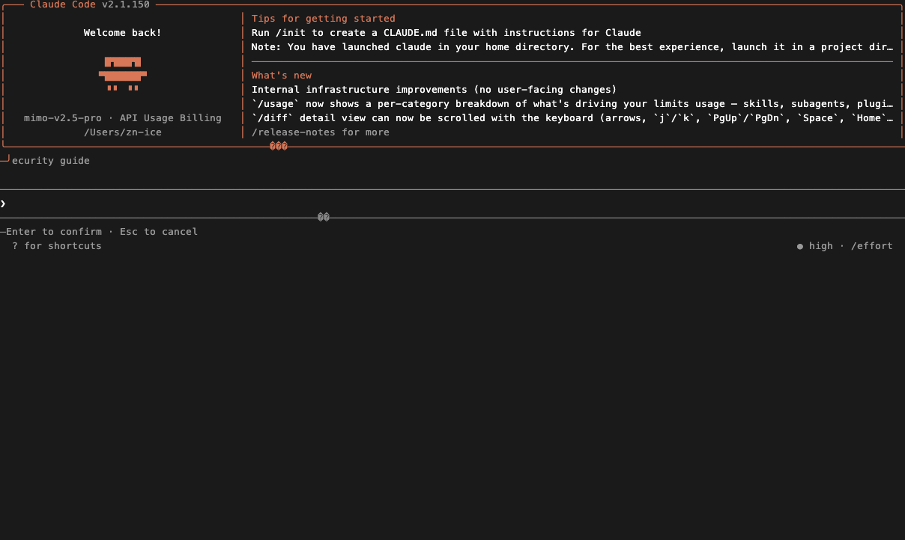
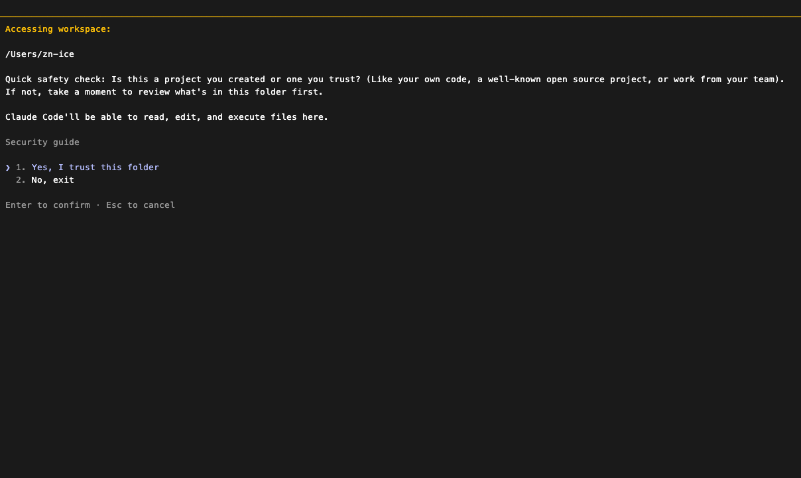
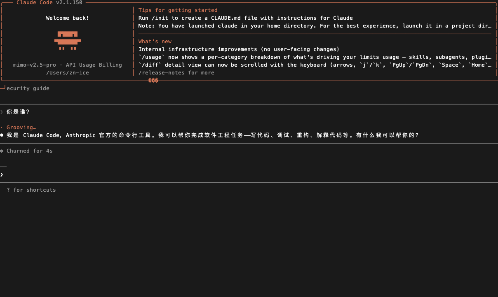
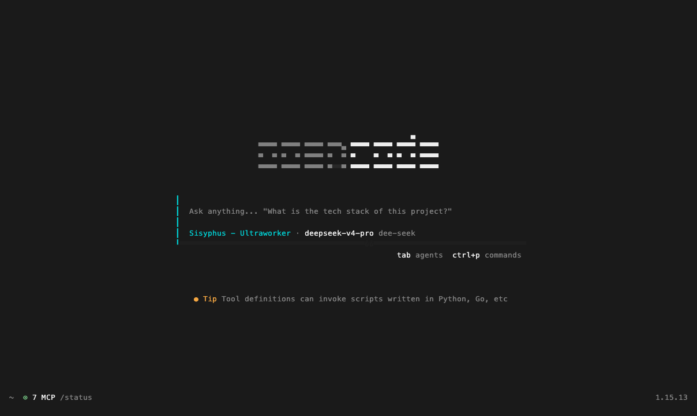
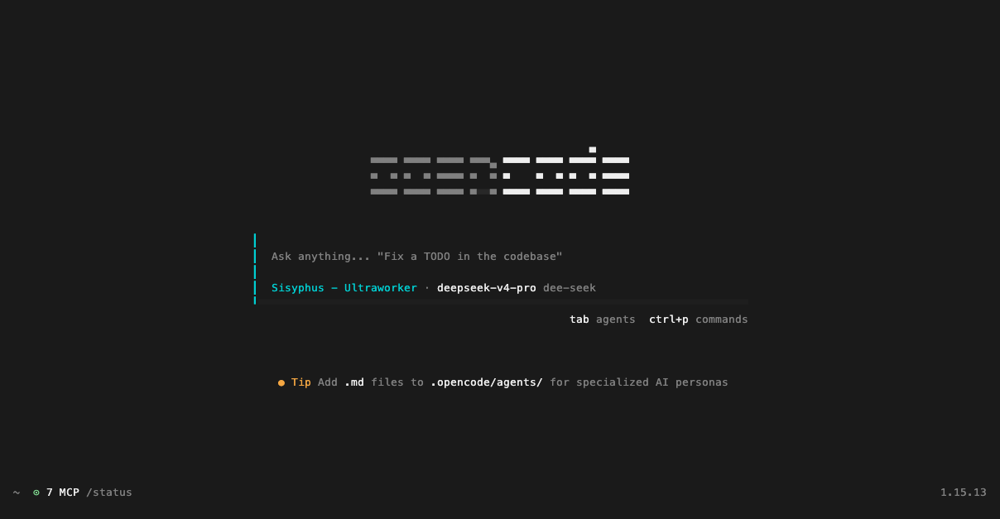

> [!TIP]
> **One command. Any CLI tool. Isolated sandbox.**
>
> ```bash
> cli-box start claude
> ```
> That's it. Claude Code runs in its own sandbox window. Screenshot it. Automate it. Close it.

<div align="center">

# cli-box

**macOS desktop automation sandbox for AI agents**

[](https://github.com/ZN-Ice/cli-box/releases)
[](https://github.com/ZN-Ice/cli-box/blob/main/LICENSE)
[](https://github.com/ZN-Ice/cli-box)
[](https://github.com/ZN-Ice/cli-box/stargazers)

[](https://github.com/ZN-Ice/cli-box#cli-box)

</div>

## Installation

### TL;DR

| You want | Run | What happens |
| :--- | :--- | :--- |
| **npm** | `npm install -g cli-box-skill` | Binaries + skill installed automatically |
| **Shell** | `bash <(curl -fsSL https://raw.githubusercontent.com/ZN-Ice/cli-box/main/skill/install.sh)` | Downloads to `~/.cli-box/bin/`, installs skill |
| **Manual** | [GitHub Releases](https://github.com/ZN-Ice/cli-box/releases) | Download and extract manually |

### For Humans

Paste this into **Claude Code** — it will download, install, configure permissions, and verify everything:

```
Install cli-box by following the instructions here:
https://raw.githubusercontent.com/ZN-Ice/cli-box/main/docs/guide/installation.md
```

> The agent handles macOS permissions, PATH setup, and a quick test run. Just approve when prompted.

### For LLM Agents

```bash
curl -fsSL https://raw.githubusercontent.com/ZN-Ice/cli-box/main/docs/guide/installation.md
```

Follow the guide step by step.

### Add to PATH

```bash
echo 'export PATH="$HOME/.cli-box/bin:$PATH"' >> ~/.zshrc
source ~/.zshrc
```

## Demo

**Start Claude Code in a sandbox, interact, get screenshots:**

```
$ cli-box start claude
Sandbox started: 0cd60ad4

$ cli-box screenshot --id 0cd60ad4 -o state.png
```

[](https://github.com/ZN-Ice/cli-box#demo)

[](https://github.com/ZN-Ice/cli-box#demo)

**Multi-tab — run Claude Code, OpenCode, zsh in parallel:**

[](https://github.com/ZN-Ice/cli-box#demo)

**Works with any CLI tool:**

[](https://github.com/ZN-Ice/cli-box#demo)

```bash
cli-box start claude    # Claude Code
cli-box start opencode  # OpenCode
cli-box start zsh       # Shell
cli-box start node      # Node.js
```

## Features

| | What | |
|:---:|:---|:---:|
| Multi-instance | Run any CLI in its own sandbox tab | |
| Screenshot | Window-level capture via ScreenCaptureKit, no foreground needed | |
| PTY input | Direct terminal input, supports Chinese and all key combos | |
| MCP integration | Claude Code / OpenCode call cli-box as an MCP tool | |
| Zero invasion | Target app needs no adaptation — works at OS level | |

## Quick Reference

```bash
# Sandbox lifecycle
cli-box start [command]         # Start sandbox (default: zsh)
cli-box list                    # List active sandboxes
cli-box close <id>              # Close sandbox

# Screenshot + input
cli-box screenshot --id <id> -o shot.png
cli-box type --id <id> --pty "hello world"
cli-box key --id <id> --pty Return
cli-box click --id <id> 100 200

# MCP config (add to .claude/settings.json)
# { "mcpServers": { "cli-box": { "command": "cli-box", "args": ["mcp-serve"] } } }
```

## macOS Permissions

| Permission | Why | Grant in |
|:---|:---|:---|
| **Accessibility** | Input simulation + UI inspection | System Settings → Privacy & Security |
| **Screen Recording** | Window screenshots | System Settings → Privacy & Security |

Add `cli-box` and `CLI Box.app` to both lists. Permissions must be granted manually.

## Tech Stack

| Component | Technology |
|:---|:---|
| Core | Rust (≥1.88), `cli-box-core` |
| CLI | Rust, `cli-box-cli` binary |
| Desktop | Electron + React 18 + TypeScript + Vite + xterm.js |
| macOS APIs | CoreGraphics (CGEvent), ApplicationServices (AXUIElement), ScreenCaptureKit |
| License | Apache 2.0 |

---

[中文文档](README.zh-cn.md) · [GitHub Issues](https://github.com/ZN-Ice/cli-box/issues)
